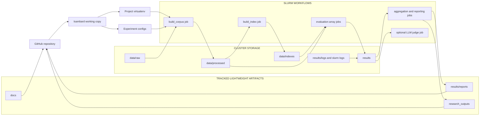
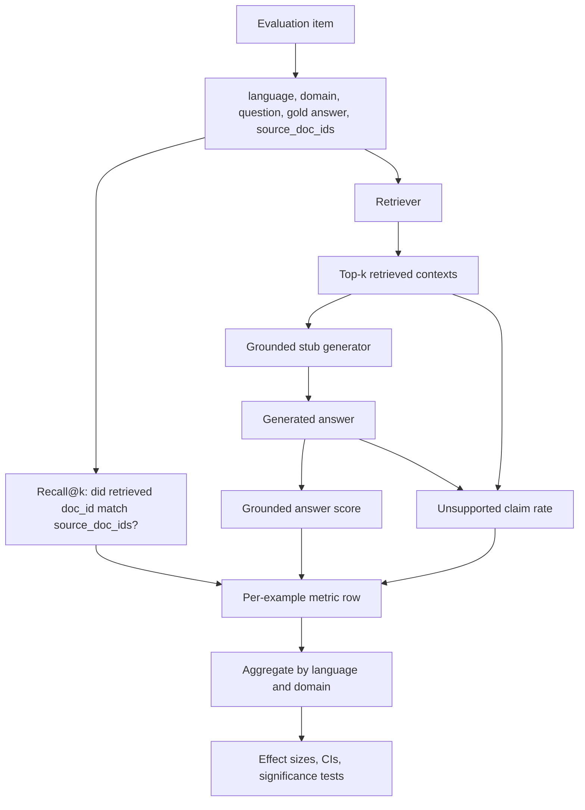
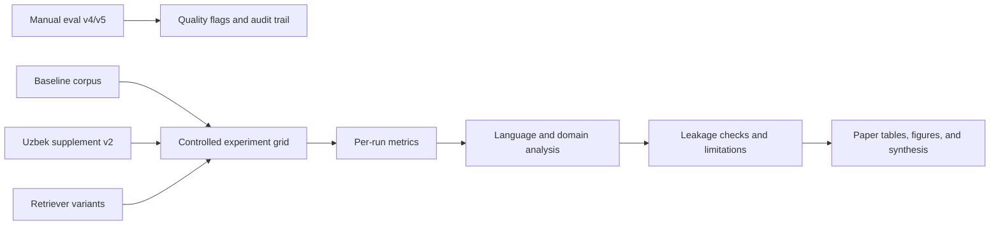

# Architecture Blueprints

These diagrams describe the SOAS RAG evaluation system as a reproducible research pipeline. They are intentionally technical and methodology-focused.

## 1. Implemented Evaluation Pipeline

```mermaid
flowchart LR
    researcher["Researcher"] --> config["YAML experiment config"]

    subgraph data["DATA AND BENCHMARKS"]
        raw["Raw public datasets"]
        manual["Manual bilingual evaluation sets"]
        supplement["Targeted Uzbek supplements"]
        audit["Gold-answer and quality audit"]
    end

    subgraph corpus["CORPUS CONSTRUCTION"]
        fetch["Fetch or stage datasets"]
        normalize["Normalize corpus JSONL"]
        enrich["Add source titles, difficulty, quality flags"]
        chunk["Optional chunking variants"]
    end

    subgraph retrieval["RETRIEVAL INDEXES"]
        tfidf["Simple TF-IDF vector index"]
        embeddings["Sentence embedding index"]
        bm25["BM25 lexical index"]
        hybrid["Hybrid lexical plus vector index"]
    end

    subgraph eval["EVALUATION"]
        runner["Config-driven evaluation runner"]
        generator["Stub grounded generator"]
        recall["Retrieval Recall at k"]
        grounding["Grounding and hallucination heuristics"]
        stats["Bootstrap CIs and effect sizes"]
    end

    subgraph outputs["RESEARCH OUTPUTS"]
        reports["Result reports"]
        tables["Summary tables"]
        figures["Figures"]
        paper["Workshop paper artifacts"]
    end

    config --> fetch
    raw --> fetch --> normalize
    manual --> runner
    supplement --> normalize
    audit --> enrich
    normalize --> enrich --> chunk
    chunk --> tfidf
    chunk --> embeddings
    chunk --> bm25
    embeddings --> hybrid
    bm25 --> hybrid
    tfidf --> runner
    embeddings --> runner
    bm25 --> runner
    hybrid --> runner
    runner --> generator
    runner --> recall
    generator --> grounding
    recall --> stats
    grounding --> stats
    stats --> reports
    stats --> tables
    stats --> figures
    reports --> paper

    classDef data fill:#E0F2FE,stroke:#0284C7,color:#0F172A
    classDef process fill:#ECFDF5,stroke:#059669,color:#0F172A
    classDef retrieval fill:#FEF3C7,stroke:#D97706,color:#0F172A
    classDef evalcls fill:#F3E8FF,stroke:#7C3AED,color:#0F172A
    classDef output fill:#F8FAFC,stroke:#64748B,color:#0F172A
    class raw,manual,supplement,audit data
    class fetch,normalize,enrich,chunk,config,researcher process
    class tfidf,embeddings,bm25,hybrid retrieval
    class runner,generator,recall,grounding,stats evalcls
    class reports,tables,figures,paper output
```

**Interpretation:** The system isolates corpus construction, retrieval indexing, evaluation, and reporting. That separation is important because the central research question compares corpus-side interventions against model-side retrieval changes.

## 2. Isambard Execution Topology

**Interpretation:** Full raw corpora, processed corpora, indexes, and run directories live on the cluster. The Git repository tracks code, configs, documentation, selected reports, figures, and small public samples.

## 3. Evaluation Control Plane

**Interpretation:** Retrieval recall is the primary metric because it directly tests whether the system can recover the intended culturally grounded source document. Generation metrics are kept secondary because the generator is intentionally lightweight.

## 4. Publication-Grade Data Flow

**Interpretation:** The benchmark is strongest when presented as a controlled comparison: same evaluation set, same metric definitions, same run structure, and one intervention varied at a time.

## Key Technical Decisions

| Decision | Reason |
| --- | --- |
| Config-driven runs | Keeps experiments reproducible and comparable |
| Source-document recall | Directly measures whether the gold evidence source was retrieved |
| Corpus supplementation experiments | Tests whether retrieval failure is caused by missing local knowledge |
| Separate English and Uzbek reporting | Prevents aggregate scores from hiding language-specific failures |
| Domain breakdown | Shows whether failures cluster in governance, history, institutions, or culture |
| Retraction note for English supplement | Preserves methodological integrity after leakage was identified |
| Lightweight public repository | Keeps large Isambard artifacts out of Git while preserving code and reports |
